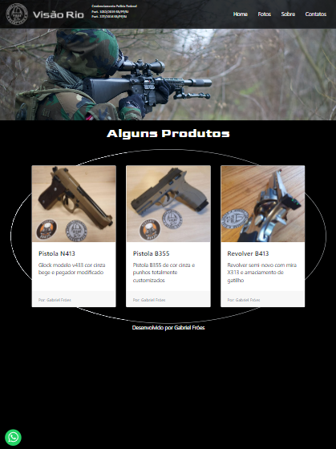

# Projeto da Visão Armaria.
Projeto e material de estudo sobre a utilização de Bootstrap para a criação de sites responsivos. 
Vale ressaltar que este é um projeto de estudo.

Disponível em: https://xdropp.github.io/projetovisaobootstrap/

